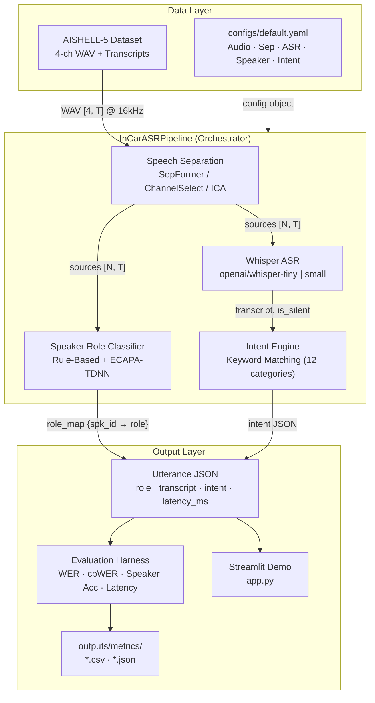
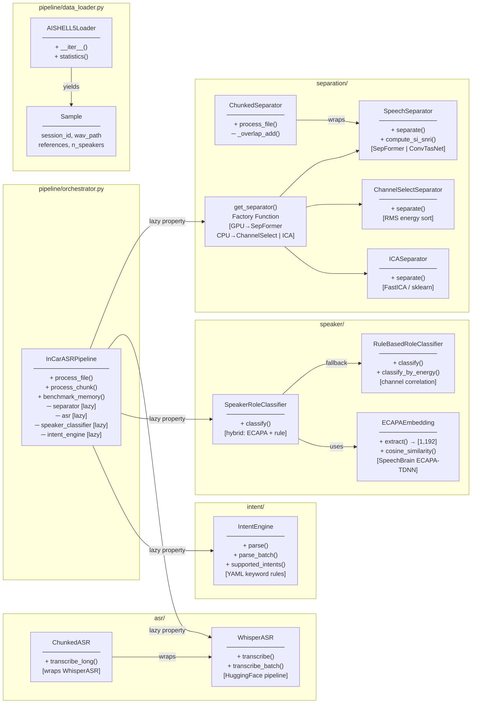
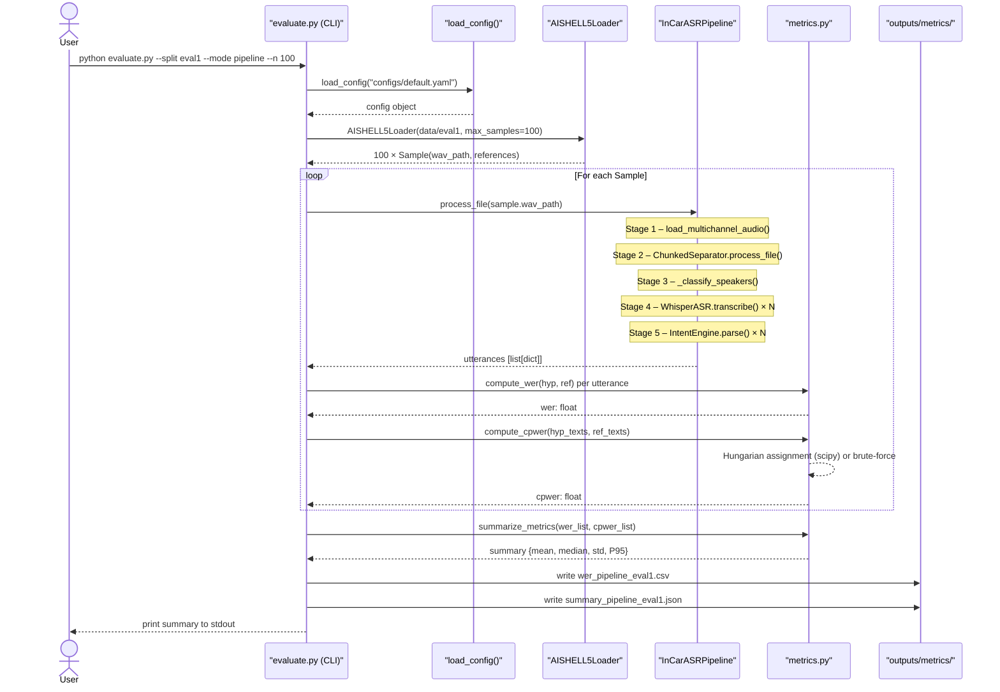
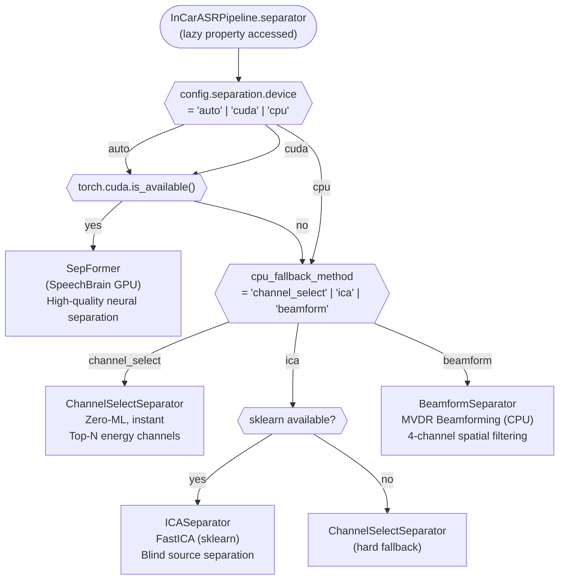

# InCar-MSAR: System Architecture & Diagrams

> **Project**: In-Car Multi-Speaker Automatic Speech Recognition  
> **Dataset**: AISHELL-5 (4-channel, Mandarin Chinese)  
> **Stack**: Python 3.10 · PyTorch · SpeechBrain · OpenAI Whisper · Asteroid · Streamlit  
> **Last updated**: 2026-04-27 (Phase 2 improvements)

---

## Architecture Summary

**InCar-MSAR** is an end-to-end pipeline for recognizing simultaneous speech from multiple passengers in a vehicle cabin. The system ingests 4-channel far-field microphone audio and produces per-speaker structured outputs containing the transcript, speaker role (Driver / Passenger), and parsed in-car command intent.

The architecture follows a **sequential modular pipeline** pattern with lazy-loaded ML models, adaptive device routing (GPU ↔ CPU fallback), and a unified evaluation harness. All modules communicate via typed Python dicts, making each stage independently testable and replaceable.

Key design decisions:
- **Lazy instantiation** — heavy models (Whisper, SepFormer, ECAPA-TDNN) are loaded on first use, enabling fast startup for Streamlit demos.
- **Device-aware routing** — a `get_separator()` factory dispatches to `SepFormer` (GPU), `ChannelSelectSeparator`/`ICASeparator` (CPU), or `BeamformSeparator` (MVDR, CPU multi-channel) at runtime.
- **Fallback logic** — if separation quality (SI-SNRi) is too low, the pipeline bypasses separation and feeds raw microphone channels directly to ASR.
- **Hybrid speaker classification** — ECAPA-TDNN embeddings verify or override the rule-based energy heuristic; if ECAPA exceeds its latency budget, it falls back to rule-based.
- **ECAPA device** — `ECAPAEmbedding` uses the **same resolved device as Whisper** (`_asr_device` in `InCarASRPipeline`), not `separation.device`, so both track GPU or CPU coherently.
- **Per-file speaker count** — `InCarASRPipeline.process_file(..., n_speakers=...)` can override the default `n_speakers` for AISHELL-5 sessions with 2–4 reference speakers in the transcript.
- **Dataset splits** — see `docs/dataset.md` §9: **dev, eval1, eval2** use materialized `wav/` + `text/`; **noise** is environmental-only and is **not** a WER split in `evaluate.py`.
- **Hallucination prevention** — `WhisperASR` applies `no_speech_threshold`, `compression_ratio_threshold`, and delegates audio >30s to `ChunkedASR` to prevent repetition artifacts on long silences.
- **Segment-level evaluation** — `evaluate.py --eval-mode segment` cuts sessions into per-utterance clips (from TextGrid) before feeding Whisper, producing accurate WER without hallucination bias.
- **Ablation-ready CLI** — `evaluate.py --sep-method [auto|channel_select|ica|beamform|sepformer]` allows direct backend comparison without editing config files.

## Implementation order vs. diagrams

`InCarASRPipeline` implements this **strict sequence** (CPU or GPU):

1. `load_multichannel_audio` → 4-ch tensor `[4, T]`.
2. `ChunkedSeparator.process_file` → separated sources `[N, T]` (input is mono-mixed for SepFormer, full multichannel for CPU backends).
3. Optional quality fallback → replace sources with per-mic slices if the heuristic says separation failed (GPU / neural path; CPU channel-select is usually skipped for this check).
4. `SpeakerRoleClassifier` / `RuleBasedRoleClassifier` on **(sources, mixture)** → `role_map`.
5. `WhisperASR.transcribe` per source track → `IntentEngine.parse` per row.

Mermaid *Diagram 1* draws parallel edges from `SEP` to `SPK` and `ASR` for data dependency; the **code runs** steps 4 then 5 so that **role is known before** intent parsing (`IntentEngine` receives `speaker=role`). This matches the “separation → role → ASR+intent” reading of the product spec.

## Evaluation (AISHELL-5)

- **cpWER** is the primary multi-speaker metric; Hungarian assignment matches hypotheses to `SPK1, SPK2, …` references.
- **Per-utterance WER in CSV** uses the **same** optimal assignment as cpWER via `assign_references_to_hypotheses()` so row-level WER is not a misleading by-product of track order.

---

## Key Components

| Module | Class(es) | Responsibility |
|---|---|---|
| `src/pipeline/orchestrator.py` | `InCarASRPipeline` | End-to-end orchestration; lazy model loading; streaming/file-level API |
| `src/pipeline/data_loader.py` | `AISHELL5Loader`, `Sample` | AISHELL-5 WAV + transcript loading and parsing |
| `src/separation/separator.py` | `SpeechSeparator`, `ChunkedSeparator` | SepFormer / ConvTasNet inference; overlap-add chunked streaming |
| `src/separation/cpu_separator.py` | `ChannelSelectSeparator`, `ICASeparator`, `BeamformSeparator`, `get_separator()` | CPU-friendly separation; MVDR beamforming on 4-ch input; factory dispatch |
| `src/asr/whisper_asr.py` | `WhisperASR`, `ChunkedASR` | HuggingFace Whisper pipeline; silence + hallucination detection; auto-chunks audio >30s |
| `src/speaker/classifier.py` | `RuleBasedRoleClassifier`, `ECAPAEmbedding`, `SpeakerRoleClassifier` | Driver/Passenger role attribution via energy correlation and 192-dim embeddings |
| `src/intent/engine.py` | `IntentEngine` | YAML-driven keyword matching → structured intent JSON (12 categories) |
| `src/evaluation/metrics.py` | standalone functions | WER (CER), cpWER (Hungarian), Speaker Accuracy, SI-SNRi |
| `configs/default.yaml` | — | Single config file: audio, separation, ASR (whisper-small, beam=2), speaker, intent, evaluation, paths |
| `evaluate.py` | `evaluate()` | Batch evaluation harness: baseline / pipeline / upper-bound; `--sep-method` ablation; `--eval-mode session|segment` |
| `scripts/error_analysis.py` | standalone script | Breakdown WER into substitution/insertion/deletion; detect hallucination via compression ratio |
| `scripts/extract_demo_clips.py` | standalone script | Auto-select 30–60s demo clips with audible overlap from data/dev |
| `app.py` | Streamlit app | Real-time demo + baseline vs. pipeline side-by-side comparison tab |

---

## Pipelines & Workflows

Three distinct execution paths exist:

1. **Inference Pipeline** (`InCarASRPipeline.process_file`) — Production path. Loads WAV → Separates → Classifies speakers → ASR per track → Parses intent.
2. **Streaming Pipeline** (`InCarASRPipeline.process_chunk`) — Real-time path. Processes a 2-second audio chunk without reading a full file.
3. **Evaluation Harness** (`evaluate.py`) — Batch path. Iterates over `AISHELL5Loader`, runs inference (pipeline/baseline/upper_bound), computes WER/cpWER/latency, saves CSV + JSON summary.

---

## Mermaid Diagrams

### Diagram 1 — High-Level System Architecture

This diagram shows the three top-level system boundaries: the data ingestion layer (AISHELL-5), the core inference pipeline, and the evaluation/demo output layer. Dashed lines indicate optional or conditional paths.

---

### Diagram 2 — Component & Module Diagram

This diagram details the class-level structure within each module, showing inheritance, composition, and the factory dispatch pattern for separation backends.

---

### Diagram 3 — Data Flow / Processing Pipeline

This diagram traces the transformation of raw audio data from disk through each processing stage to the final structured utterance output. Tensor shapes and data types are annotated at key edges.

```mermaid
flowchart LR
    WAV["WAV File<br/>4-ch · 16kHz<br/>shape: [4, T]"]

    MIX["Channel Mix<br/>mono [1, T]<br/>(SepFormer path only)"]

    CHUNK["ChunkedSeparator<br/>2s chunks<br/>+ 0.2s overlap"]

    SEP_OUT["Separated Sources<br/>shape: [N, T]<br/>N = 2–4 speakers"]

    QUALITY{{"SI-SNRi Check<br/>energy ratio > 1.1?"}}

    FALLBACK["Fallback Sources<br/>raw mic channels<br/>[N, T] from [4, T]"]

    ROLE["RuleBasedRoleClassifier<br/>cross-correlation<br/>with driver channel [0]"]

    ECAPA_EMB["ECAPA-TDNN<br/>192-dim embedding<br/>per track"]

    ROLE_MAP["role_map<br/>{0: 'Driver', 1: 'Passenger_1'}"]

    WHISPER["WhisperASR<br/>HuggingFace pipeline<br/>lang=zh, beam=1 | 2"]

    SILENCE{{"RMS < 1e-4?<br/>(silence check)"}}

    TRANSCRIPT["transcript: str<br/>is_silent: bool<br/>inference_ms: float"]

    INTENT["IntentEngine<br/>keyword regex match<br/>12 intent categories"]

    UTTERANCE["Utterance Dict<br/>──────────────<br/>file_id · timestamp<br/>speaker_id · role<br/>transcript · intent<br/>sep_ms · asr_ms · total_ms"]

    WAV -->|"load_multichannel_audio()"| MIX
    WAV --> CHUNK
    MIX --> CHUNK
    CHUNK -->|"overlap-add"| SEP_OUT
    SEP_OUT --> QUALITY

    QUALITY -->|"yes – good separation"| ROLE
    QUALITY -->|"no – low SI-SNRi"| FALLBACK

    FALLBACK --> ROLE
    WAV -->|"multichannel ref"| ROLE

    ROLE -->|"rule-based"| ROLE_MAP
    ROLE --> ECAPA_EMB
    ECAPA_EMB -->|"cosine verify / override"| ROLE_MAP

    SEP_OUT --> WHISPER
    FALLBACK --> WHISPER

    WHISPER --> SILENCE
    SILENCE -->|"silent"| TRANSCRIPT
    SILENCE -->|"speech"| TRANSCRIPT

    TRANSCRIPT --> INTENT

    ROLE_MAP --> UTTERANCE
    TRANSCRIPT --> UTTERANCE
    INTENT --> UTTERANCE
```

---

### Diagram 4 — Evaluation Workflow / Sequence Diagram

This sequence diagram shows the interaction between the evaluation harness, data loader, and pipeline across a single evaluation session, covering all three evaluation modes.

---

### Diagram 5 — Device & Separation Backend Selection (Decision Tree)

This diagram captures the implicit runtime branching logic for selecting the appropriate separation and speaker classification backend based on hardware availability and configuration.

